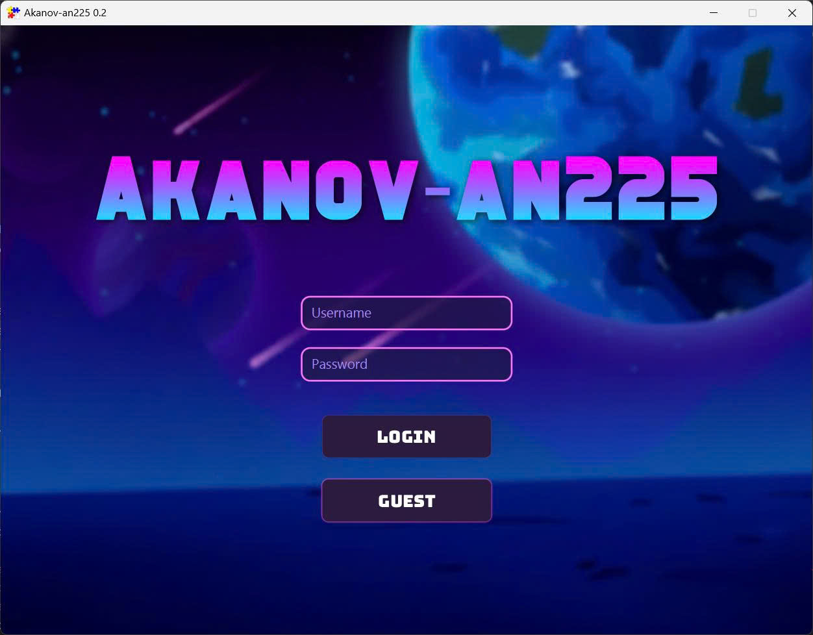
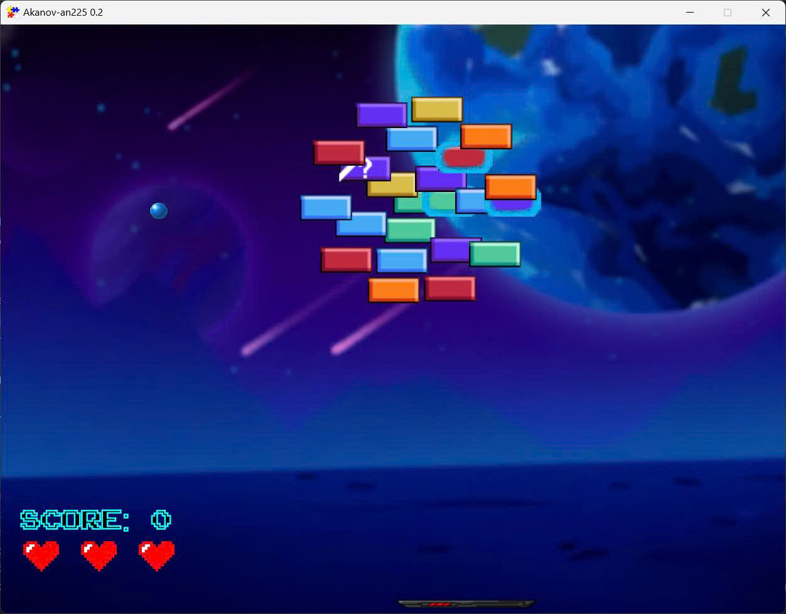
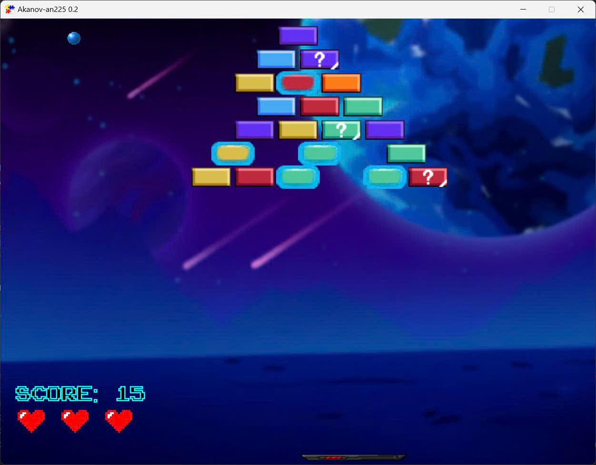

# Arkanoid Game - Object-Oriented Programming Project

## Author
Group 8 - Class INT2204 5
1. Lê Khắc Quang Huy - 24020158
2. Nguyễn Thiên Tuấn - 24020347
3. Phạm Quang Anh - 24020023
4. Nguyễn Văn Tuyên - 24020356

**Instructor**: Kiều Văn Tuyên  
**Semester**: 2526I

---

## Description
This is a classic Arkanoid game developed in Java as a final project for Object-Oriented Programming course. The project demonstrates the implementation of OOP principles and design patterns.

**Key features:**
1. User Account Management: Implement login/logout functionality and enable saving and loading game progress through user sessions.
2. User-Friendly UX/UI: Improve overall interface design to provide a smoother and more intuitive user experience.
3. Diverse Item Graphics: Create a wider variety of item designs with distinctive visual styles.
4. High-Quality Assets: Use high-resolution images, clear audio, and well-chosen fonts to enhance visual and auditory quality.

**Game mechanics:**
- Control a paddle to bounce a ball and destroy bricks
- Collect power-ups for special abilities
- Score points and compete on the leaderboard

---

## UML Diagram

### Class Diagram

---

## Design Patterns Implementation

### 1. Singleton Pattern
**Used in:** `BrickManager`
**Purpose:** Ensure only one instance exists throughout the application.

### 2. Factory Pattern
**Used in:** `BrickManager`
**Purpose:** Generate different kinds of bricks layout.

---

## Multithreading Implementation

1. **Game Loop Thread**: FXGL
3. **Audio Thread Pool**: Plays sound effects asynchronously
4. **I/O Thread**: Handles save/load operations without blocking UI

---

## Installation

1. Clone the project from the repository.
2. Open the project in the IDE.
3. Run the project.

## Usage

### Controls
| Key | Action |
|-----|--------|
| `←` | Move paddle left |
| `→` | Move paddle right |
| `ESC` | Pause game |

### How to Play
1. **Login game**: Click "Log in" from the main menu to log in or play as guest
2. **Control the paddle**: Use arrow keys to move left and right.
3. **Launch the ball**: Press SPACE to launch the ball from the paddle after dead.
4. **Destroy bricks**: Bounce the ball to hit and destroy bricks.
5. **Collect power-ups**: Catch falling power-ups for special abilities.
6. **Avoid losing the ball**: Keep the ball from falling below the paddle.
7. **Get Higest Score**: Destroy all destructible bricks to advance.

### Power-ups
 Name | Effect |
|------|--------|
| Buff Paddle | Increases paddle width for 20 seconds |
| Nerf Paddle | Decreases paddle width for 20 seconds |
| Frozen Paddle | Can not move for 1 seconds |
| Hard Ball | Go through bricks for 10 seconds |
| Speed Ball | Increases ball speed by 20% for 10 seconds |
| Extra Life | Add 1 life |

### Scoring System
- Normal Brick: 5 points
- Hard Brick: 1 + 5 points
- Power-up Brick: 10 points

---

### Screenshots

**Login Menu**

**Main Menu**  

**Gameplay**  

---

## Future Improvements

1. **Gameplay Enhancements**
   - Add more power-ups such as split ball, laser paddle, or shield.
   - Introduce moving enemies or obstacles to increase difficulty.
   - Boss battles with special bricks or paddle-attacking mechanics.

2. **Player Experience**
   - Support multiple players: co-op or versus modes.
   - Customizable paddle and balls (shape, color, effects).
   - High score tracking and achievements for replay value.

3. **Technical Improvements**
   - Improved physics engine for more accurate ball collisions, including multi-brick interactions.
   - Performance optimization for smooth gameplay with many bricks/effects.
   - Level editor for creating and sharing custom levels.

### Planned Features
1. **Additional game modes**
   - Time attack mode
   - Survival mode with endless levels
   - Co-op multiplayer mode

2. **Enhanced gameplay**
   - Boss battles at end of worlds
   - More power-up varieties (freeze time, shield wall, etc.)
   - Achievements system

---

## Technologies Used

| Technology | Version | Purpose |
|------------|---------|---------|
| Java | 17+ | Core language |
| JavaFX | 19.0.2 | GUI framework |
| Maven | 3.9+ | Build tool |
| FXGL | 17.3 | JavaFX Game Framework |

---

## License

This project is developed for educational purposes only.

**Academic Integrity:** This code is provided as a reference. Please follow your institution's academic integrity policies.

---

## Notes

- The game was developed as part of the Object-Oriented Programming with Java course curriculum.
- All code is written by group members with guidance from the instructor.
- Some assets (images, sounds) may be used for educational purposes under fair use.
- The project demonstrates practical application of OOP concepts and design patterns.

---

*Last updated: [12/11/2025]*

